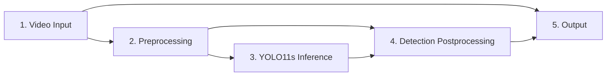

# PipeGen Pipeline IR Node Graph

Generated from `PipelineIR.json`. Connections reflect the actual IR ports.

```mermaid
flowchart LR
    N1["1. Video Input"]
    N2["2. Preprocessing"]
    N3["3. YOLO11s Inference"]
    N4["4. Detection Postprocessing"]
    N5["5. Output"]
    N1 --> N2
    N1 --> N5
    N2 --> N3
    N2 --> N4
    N3 --> N4
    N4 --> N5
```
